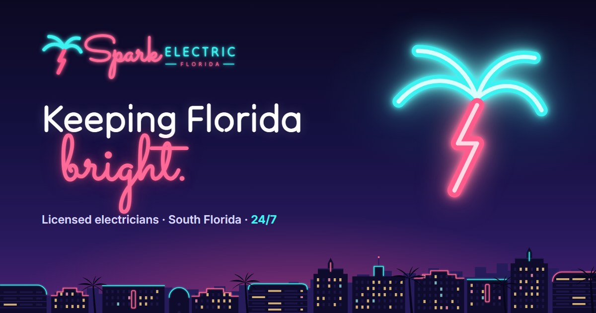

# SparkElectric

Marketing website for a Florida electrical contractor, built as a portfolio piece: logo, brand palette and a one-page site. Plain HTML, CSS and JavaScript, no build step and no dependencies.



## The brand

"Neon Palm": a Florida palm whose trunk is a lightning bolt, drawn in neon tubes like the signs of Miami Beach. Electricity and Florida share one symbol, and the flamingo script and aqua capitals glow like a sign after dark.

| Colour | Hex | Used for |
| --- | --- | --- |
| Night | `#17133F` | Headings, header, dark sections |
| Flamingo | `#FF4F7B` | Logo script and trunk, accents |
| Flamingo 600 | `#D92D63` | Buttons (4.7:1 with white text) |
| Neon Aqua | `#3DF2F0` | Neon tubes, accents on dark |
| Lagoon | `#0E97A8` | Logo capitals, icons on light |
| Lagoon 700 | `#0B7A89` | Text links on light (5:1 on white) |
| Blush | `#FFF1EE` | Light sections |

Type: **Tilt Neon** for headings, **Sacramento** for the neon script accents, **Inter** for body text.

Logo text is converted to vector outlines, so `images/logo.svg` renders identically anywhere, including as an `` and without the fonts installed. `images/logo-light.svg` is the lit version for dark backgrounds, with the glow built in.

## The hero

A neon palm "OPEN 24/7" sign hangs on a clear acrylic backer above a Miami Art Deco skyline at night. Once the fonts load, the tubes flicker on like a real sign warming up, and every few seconds a pulse of current runs down the lightning-bolt trunk. The skyline has lit windows, neon trims and a blinking rooftop beacon. The looping effects pause when the hero scrolls out of view, and visitors who prefer reduced motion get the sign already lit.

## Running it

Open `index.html` directly, or serve the folder:

```bash
python -m http.server 8000
```

VS Code's Live Server works too. All paths are relative to the project root.

## Structure

```
index.html          one page: hero, services, emergency line, how it works, why us, reviews, quote, areas, FAQ
css/styles.css      tokens → base → layout → components → sections
js/main.js          mobile menu, scroll reveal, active nav link, neon power-on, quote form
images/             logo, favicons, social share image
brand/              logo concept sheet from the exploration round
```

The nav links jump to sections on the one page; there are no separate subpages.

## About the content

The business name and phone number are real; everything else is placeholder copy for the demo. The email, reviews, ratings, job counts and claims such as "licensed & insured", "state-certified" and the 2-year warranty are invented and should be replaced before this is used as a live business site. A live site should also show the contractor's real license number. The quote form validates and shows a confirmation, but sends nothing: there's a marked spot in `js/main.js` for connecting a form service.
